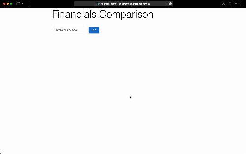

# Financial Comparison App

This project is a web application that allows users to compare financial data for different stock symbols. It consists of a Go backend that scrapes financial data from Yahoo Finance and a React frontend that displays the comparison in a table format.

## Demo


## Features

- Add multiple stock symbols for comparison
- Display key financial metrics in a table format
- Automatic data updates every 15 minutes

## Technologies Used

- Backend:
  - Go
  - [colly](https://github.com/gocolly/colly) for web scraping
  - [cors](https://github.com/rs/cors) for handling CORS
- Frontend:
  - React
  - Material-UI for styling
  - Axios for API requests

## Setup and Installation

1. Clone the repository:
   ```
   git clone https://github.com/your-username/financial-comparison-app.git
   cd financial-comparison-app
   ```

2. Start the application using Docker Compose:
   ```
   docker-compose up --build
   ```

3. Access the application at `http://localhost:80`

## Usage

1. Modify the constant on line 15: const FRONTEND_URL = "*".
2. Enter a stock symbol in the input field and click "Add".
3. The app will fetch and display financial data for the entered symbol.
4. Add multiple symbols to compare their financial metrics side by side.

## API Endpoints

- `GET /compare?symbols[]=SYMBOL1&symbols[]=SYMBOL2`: Fetch financial data for the specified symbols.

## Environment Variables

- Frontend:
  - `REACT_APP_API_URL`: URL of the backend API (default: `http://localhost:8080`)
